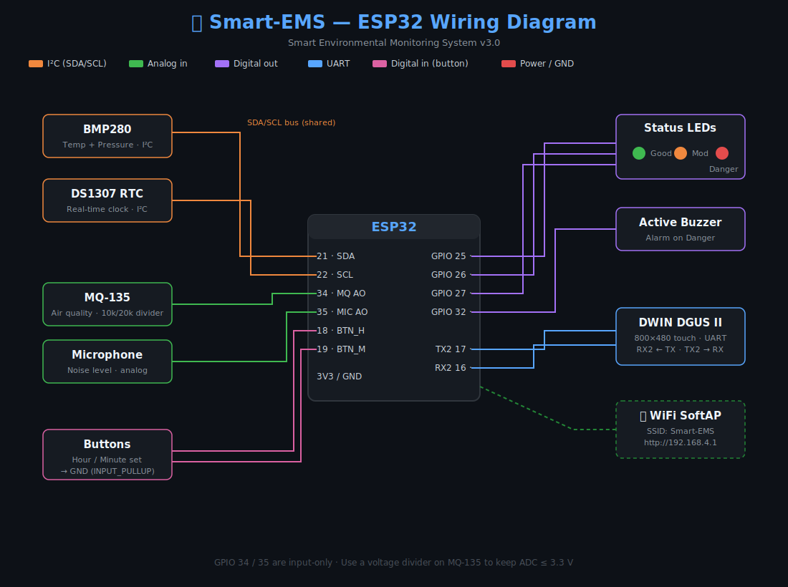

# 🌿 Smart Environmental Monitoring System (Smart-EMS)


A real-time environmental monitoring station built around the **ESP32**. It reads temperature, pressure, air quality, and noise, classifies the environment into **Good / Moderate / Danger** levels, and presents the data on three surfaces at once:

- A **DWIN DGUS II** capacitive touch display (800 × 480)
- A set of **LED indicators + buzzer** for at-a-glance / audible alerts
- A **WiFi web dashboard** served directly from the ESP32 (AJAX, 1-second refresh)

---

## 📸 Gallery

|  

**Wiring diagram:**




---

## ✨ Features

- **Multi-sensor sensing** — BMP280 (temperature + pressure), MQ-135 (air quality / PPM estimate), and a microphone module (noise in dB).
- **3-level alert engine** — combines all sensors into a single `Good (1) / Moderate (2) / Danger (3)` system level that drives the LEDs, buzzer, display status icon, and web badge.
- **DWIN touch UI** — three pages: a clock, a sensor overview, and an MQ-135 detail page, updated over UART using the DGUS II protocol.
- **Built-in web dashboard** — ESP32 runs a SoftAP + HTTP server; any phone/laptop on the AP gets a live dashboard with no internet required.
- **Real-time clock** — DS1307 RTC with a `millis()`-based software-clock fallback if the RTC is absent. Two push-buttons set hours/minutes.
- **MQ-135 warm-up handling** — air-quality readings are suppressed for the first ~35 s while the heater stabilizes, preventing false alarms.
- **Non-blocking architecture** — all periodic work is `millis()`-timed; no `delay()` in the main loop path.

---

## 🧰 Hardware

| Component | Part | Notes |
|-----------|------|-------|
| MCU | ESP32 Dev Module | Dual-core, WiFi |
| Temp / Pressure | BMP280 | I²C (0x76 or 0x77) |
| Air Quality | MQ-135 | Analog out via 10k/20k voltage divider → 0–3.3 V |
| Noise | Microphone module | Analog out, peak-to-peak sampled |
| Display | DWIN DGUS II `DMG80480C050_03WTR` | 800 × 480, UART |
| Clock | DS1307 RTC | I²C, optional |
| Indicators | 3 × LED (Green / Orange / Red) | Status levels |
| Alarm | Active buzzer | Beeps on Danger |
| Inputs | 2 × push-button | Set hour / minute |

---

## 🔌 Wiring

See [`connection.svg`](connection.svg) for the full wiring diagram.

| Function | ESP32 Pin | Connects To |
|----------|-----------|-------------|
| I²C SDA | GPIO 21 | BMP280 SDA + DS1307 SDA |
| I²C SCL | GPIO 22 | BMP280 SCL + DS1307 SCL |
| MQ-135 AO | GPIO 34 | MQ-135 analog out (via divider) |
| Microphone AO | GPIO 35 | Mic analog out |
| LED Green | GPIO 25 | Level 1 — Good |
| LED Orange | GPIO 26 | Level 2 — Moderate |
| LED Red | GPIO 27 | Level 3 — Danger |
| Buzzer | GPIO 32 | Active buzzer |
| Hour button | GPIO 18 | Button → GND (`INPUT_PULLUP`) |
| Minute button | GPIO 19 | Button → GND (`INPUT_PULLUP`) |
| DWIN TX | GPIO 17 (TX2) | DWIN RX2 |
| DWIN RX | GPIO 16 (RX2) | DWIN TX2 |

> ⚠️ GPIO 34 and 35 are **input-only** (no internal pull-up) — correct for analog sensors.
> ⚠️ The MQ-135 outputs up to 5 V; use a voltage divider so the ESP32 ADC never exceeds 3.3 V.

---

## 📚 Required Libraries

Install via the Arduino **Library Manager**:

- Adafruit BMP280 Library
- Adafruit Unified Sensor
- RTClib (by Adafruit)

`WiFi`, `WebServer`, and `Wire` are bundled with the ESP32 Arduino core.

---

## 🚀 Getting Started

1. Install the **ESP32 board package** in the Arduino IDE (Boards Manager → "esp32").
2. Install the libraries listed above.
3. Open `Smart_EMS.ino`, select your ESP32 board and port.
4. Upload the sketch.
5. Load the DWIN UI project (the `DWIN_SET` / `TFT` assets) onto the display's SD card.
6. Power on. The system runs a self-test (LED sweep + 2 beeps), then starts.

### Connecting to the dashboard

1. On your phone/laptop, join the WiFi network:
   - **SSID:** `Smart-EMS`
   - **Password:** `12345678`
2. Open a browser to **`http://192.168.4.1`**.
3. The dashboard auto-refreshes every second.

> Open the Serial Monitor at **115200 baud** to watch live sensor logs and the MQ-135 warm-up countdown.

---

## 🎚️ Thresholds & Tuning

Edit these `#define`s near the top of `Smart_EMS.ino` to match your environment:

| Setting | Default | Meaning |
|---------|---------|---------|
| `TEMP_GOOD` | 28.0 °C | Below this = Good |
| `TEMP_MODERATE` | 35.0 °C | Above this = Danger |
| `AQ_GOOD` | 150 | MQ-135 ADC; clean air ≈ 80–150 |
| `AQ_MODERATE` | 250 | Above this = Danger |
| `NOISE_GOOD` | 50 dB | Below this = Good |
| `NOISE_MODERATE` | 70 dB | Above this = Danger |
| `MQ_WARMUP_MS` | 35000 | Heater warm-up window |

The MQ-135 PPM estimate uses a power-law calibrated to a clean-air baseline (`BASE_ADC` in `calcPPM()`). Read your own sensor's clean-air ADC from the Serial Monitor and set it there for accurate PPM values.

---

## 🌐 API

The dashboard pulls from a single JSON endpoint:

```
GET /api/data
```

```json
{
  "temperature": 27.4,
  "humidity": 55.0,
  "pressure": 1012.3,
  "airQuality": 142,
  "noiseLevel": 45,
  "level": 1,
  "mqReady": true,
  "aqRemaining": 0,
  "time": "08:42:13 PM"
}
```


---

## 🖥️ DWIN Display Pages

| Page | Content | VP Range |
|------|---------|----------|
| 1 | Clock (HH:MM:SS + AM/PM) | `0x1000`–`0x1003` |
| 2 | Sensor overview | `0x1030`–`0x1070` |
| 3 | MQ-135 detail (AQI / PPM / status) | `0x3000`–`0x3020` |

Values are written using the DGUS II frame format `5A A5 05 82 [AddrHi] [AddrLo] [ValHi] [ValLo]`.

---

---

## 📝 License

Released under the MIT License — free to use, modify, and distribute. See [`LICENSE`](LICENSE).

---

